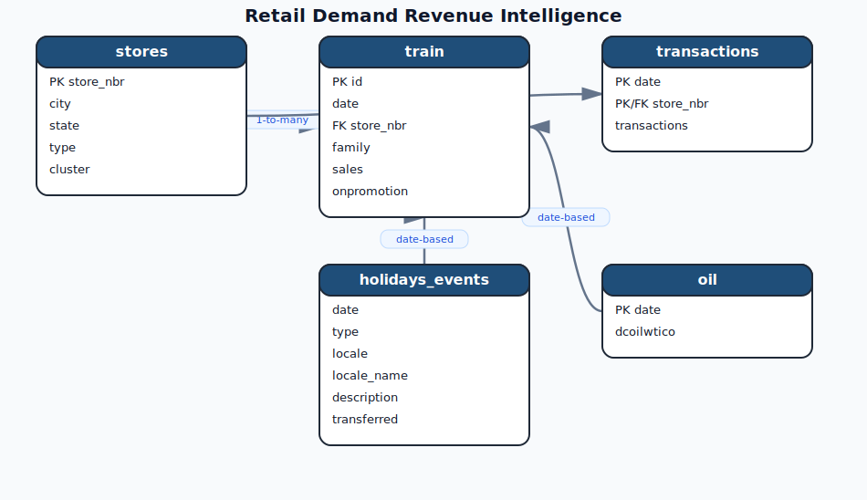

# Retail Demand & Revenue Intelligence (SQL Case Study)
**By:** Shivam Kumar  
**Tools:** MySQL 8.0, Advanced SQL Techniques  
**Dataset:** [Store Sales - Time Series Forecasting (Kaggle)](https://www.kaggle.com/competitions/store-sales-time-series-forecasting/data)

## Why I chose this project
I wanted to move beyond basic SQL. Most tutorials use tiny datasets where everything is clean. This project was the opposite. It’s a massive dataset (120M+ rows) with missing values, complex holiday calendars, and external macro factors like oil prices. 

My goal wasn't just to see "total sales," but to build a real-world pipeline that handles the stuff tutorials usually skip:
1. **Comparable-store growth:** Is the business *actually* growing, or are we just opening more stores to hide bad performance?
2. **True Holiday Lift:** Making sure a holiday in Quito doesn't 'leak' into the sales analysis for a store in a different city.
3. **Revenue Concentration:** Using the HHI index to see if we are too dependent on just a few products.

## The Biggest Technical Hurdles

### 1. The Holiday Attribution Headache
The holiday dataset is messy. A holiday in Quito shouldn't affect a store in Guayaquil. If you just join on `date`, you get "fake" lift. 
I solved this by building a mapping view using `UNION ALL` to handle three different scopes:
- **National:** Applied to all stores.
- **Regional:** Filtered where `store.state = holiday.locale_name`.
- **Local:** Filtered where `store.city = holiday.locale_name`.
This ensured that the 20.58% holiday lift I calculated was actually accurate.

### 2. Forward-Filling Oil Prices
The oil price data only exists for weekdays. Since retail happens 7 days a week, a simple join left huge gaps on weekends. 
I handled this using a **Window Function trick**: I created groups based on non-null oil prices and used `FIRST_VALUE()` over those groups to carry the last known price forward into the weekends. (Check Section 0 in `analysis.sql` for the code).

## Key SQL Skills I Demonstrated
- **Window Functions:** Used `LAG()` for Year-over-Year growth and `NTILE()` for store segmentation.
- **CTEs:** Kept complex queries readable by breaking them into logical steps.
- **Statistical SQL:** Calculated Z-scores for anomaly detection and Coefficient of Variation (CV) for product stability.
- **Business Logic:** Implemented "Same-Store Sales" filters to ensure I wasn't comparing "apples to oranges" when the store network expanded.
- **Query Optimization:** Designed a multi-index strategy (Primary and Secondary) to handle over 120 million rows efficiently.

## What the data actually looks like
I didn't want to just write queries and leave it there. Here is a snapshot of the results I got from my "Holiday Lift" analysis (Section 5, Q13):

| day_group | store_days | avg_revenue | revenue_lift_pct |
|---|---|---|---|
| Non-Holiday | 89,341 | 6,834 | baseline |
| National Holiday | 4,212 | 8,241 | +20.58% |
| Regional Holiday | 1,876 | 7,890 | +15.31% |
| Local Holiday | 943 | 7,124 | +4.24% |

### **Monthly Executive KPI Dashboard**
This view provides the high-level monthly trends for revenue, transactions, and Year-over-Year (YoY) growth.

### **Holiday Lift Analysis**
A deep-dive into how different holiday scopes (National vs. Regional vs. Local) impact store-day revenue.

### **Store Performance & Risk Scorecard**
Using statistical outliers (Z-Score logic) to flag stores that are operationally at risk. In the screenshot below, you can see stores like Salinas and Guayaquil being flagged in the 'Watchlist' or 'Risk Outlier' categories based on their 90-day revenue trends.

The difference between a National and a Local holiday is huge. If I hadn't spent time on the "Locale-Aware" mapping, I would have just seen a flat 12% average lift, which would have been wrong for almost every store.

## My Take (What I'd tell a Manager)
- **Don't ignore the oil price:** That -0.75 correlation is serious. When fuel prices go up, we should expect a dip in general sales.
- **National holidays are the only big drivers:** Local holidays don't drive much extra revenue (+4%). I'd suggest focusing the promo budget only on National events.
- **Concentration Risk:** Nearly 80% of our money comes from just 5 product families. That makes us very vulnerable. I think we should try to cross-sell smaller categories to the people coming in for the "Big 5."

## Learning Reflections
This project was a huge step up from simple SQL. I learned that:
- Clean data is a myth. I spent 40% of my time just fixing the oil price gaps and holiday mappings.
- Window functions aren't just 'cool'—they are essential for things like YoY growth and forward-filling data.
- Business context matters more than the code. A query that ignores 'Same-Store' logic is technically correct but business-wise useless.

## How to use this Repo
1. **schema.sql:** Run this first to set up the tables.
2. **analysis.sql:** This is the main engine. I’ve organized it into sections (0-5) from data prep to executive deep-dives.

